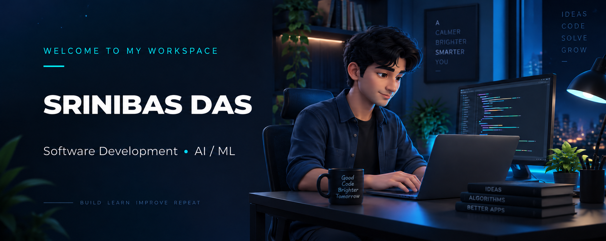

<!-- PROFILE BANNER -->

  

<h3 align="center">
  Computer Science Student · Software Developer · AI/ML Enthusiast
</h3>

  Exploring ideas through code and building practical solutions.

<!-- SOCIAL LINKS -->

  
  
  

---

## 👨‍💻 A Little About Me

I'm **Srinibas Das**, a Computer Science student who enjoys turning ideas into working applications. My interests include **software development, web technologies, and artificial intelligence**.

For me, projects are a way to understand concepts deeply: break down a problem, build a solution, test it, and make it better. I'm growing my skills in **Java and Python** while strengthening the foundations that help me write clear, reliable code.

### What I'm Working Toward

- **Building with purpose** — Creating practical software and AI/ML projects.
- **Strengthening fundamentals** — Practicing DSA, SQL, and problem solving.
- **Developing better habits** — Improving code structure, documentation, and Git workflows.
- **Learning from others** — Welcoming collaboration, feedback, and code reviews.
- **Exploring software design** — Learning how applications are organized and maintained.

  <strong>Curiosity drives the idea. Practice turns it into code.</strong>

---

## 👨‍💻 About Me

I'm a **Computer Science student and software developer** who enjoys turning what I learn into things people can use. My interests span **software development, web applications, and AI/ML**, with a focus on understanding how things work and building them step by step.

I learn best by working on projects—writing code, solving problems, and improving with every iteration. I'm developing stronger foundations in **Java, Python, and Data Structures & Algorithms**, while exploring how to build reliable, well-structured applications.

- 🔭 **Building:** Practical projects in software development and AI/ML.
- 🌱 **Learning:** DSA, SQL, Git/GitHub, and machine learning fundamentals.
- 🤝 **Open to:** Project collaborations, shared learning, and constructive code reviews.
- 🎯 **Working toward:** Better problem-solving skills, cleaner code, and thoughtful software design.
- 💬 **Let's discuss:** Python, Java, CSE projects, and lessons from building.
- ⚡ **What keeps me curious:** Seeing an idea become a working application.

---

## 🧰 Technologies & Tools

### 💻 Programming Languages

### 🌐 Web Development

### 🧠 AI, Machine Learning & Data Analysis

### 📈 Data Visualization

### ☁️ Cloud & Databases

### ⚙️ Development Environment

---

## 🌱 Current Learning Focus

| Area | Focus |
| :--- | :--- |
| **Problem Solving** | Practicing DSA and understanding algorithm efficiency |
| **Software Development** | Writing readable, modular, and maintainable code |
| **AI & Machine Learning** | Exploring data preparation, model training, and evaluation |
| **Databases** | Strengthening SQL and database design fundamentals |
| **Developer Workflow** | Learning version control and collaborative development |

---

## 📊 GitHub Activity

  

  

  

---

## 🤝 Let's Connect

Have a project idea or a shared interest in programming? I'd be happy to exchange ideas, learn together, and explore opportunities to collaborate.

  
  
  
  

---

  <em>Always learning. Always building.</em>

